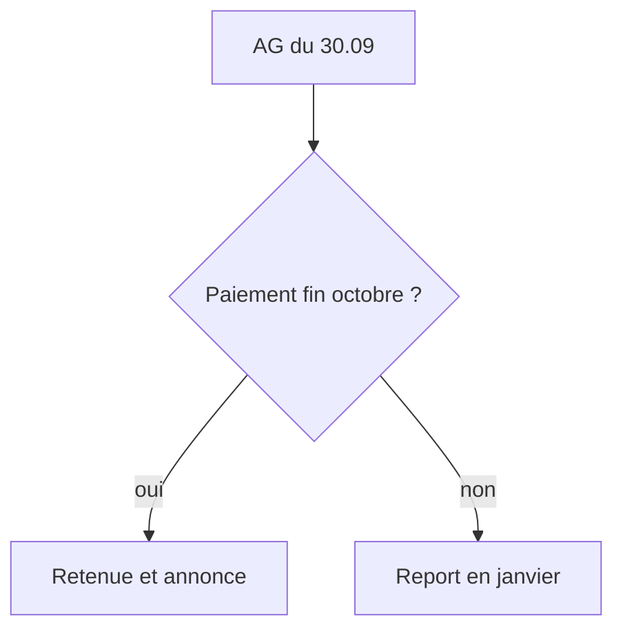

## Résumé exécutif
Le dividende de CHF 200000 voté le 2026-09-30 peut être versé avant fin octobre. La société doit retenir l'impôt anticipé et l'annoncer dans les délais (BIB-001). Le montant net versé à l'actionnaire est de CHF 130000. [données fictives]

## Question
Rochat Holding SA peut-elle verser le dividende avant le 31 octobre 2026, et que doit-elle annoncer ?

## Faits
L'assemblée générale du 30 septembre 2026 a voté un dividende de CHF 200000 [déclaré par J.-M. Rochat le 2026-10-01]. Les comptes 2025 ont été approuvés le même jour.

## Droit applicable
Le taux de l'impôt anticipé sur les dividendes est de 35 %. La retenue est due à l'échéance de la prestation (BIB-001).

## Analyse
Rien ne s'oppose à un versement fin octobre. La décision de l'assemblée suffit ; le conseil d'administration fixe la date de paiement.

Il faut toutefois prévoir la trésorerie de l'impôt retenu, qui doit être versé à l'administration fédérale.

## Options
| Option | Montant brut | Impôt retenu | Net versé |
|---|---|---|---|
| Versement fin octobre | CHF 200000 | CHF 70000 | CHF 130000 |
| Versement en janvier | CHF 200000 | CHF 70000 | CHF 130000 |

```graphique
type: barres
message: Le net versé reste identique quelle que soit la date
unite: CHF
source: calcul de l'équipe sur données fictives
x: [Fin octobre, Janvier]
series: {Brut: [200000, 200000], Net: [130000, 130000]}
```

## Risques
Un retard d'annonce entraîne des intérêts moratoires. Le risque est faible si le formulaire part avec le paiement.



## Recommandation
Verser le dividende le 30 octobre 2026 et préparer le formulaire d'annonce dès maintenant.

## Réserves
Les montants reposent sur le procès-verbal fictif ; le taux est à confirmer contre le texte officiel.

## Niveau de confort
Moyen : le texte de loi n'est pas encore ingéré dans la bibliothèque.

## Annexe des sources
Voir le tableau ci-dessous.
